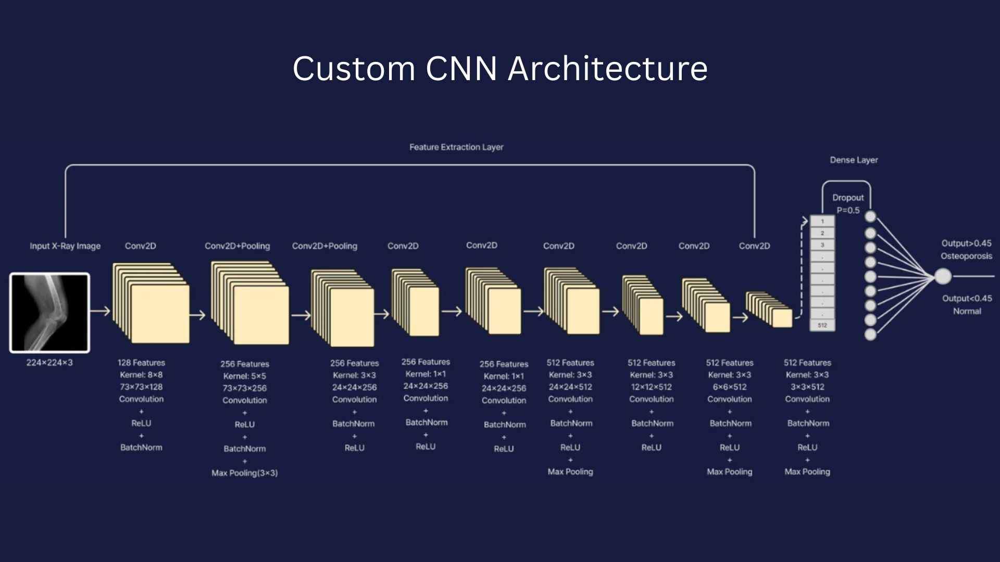
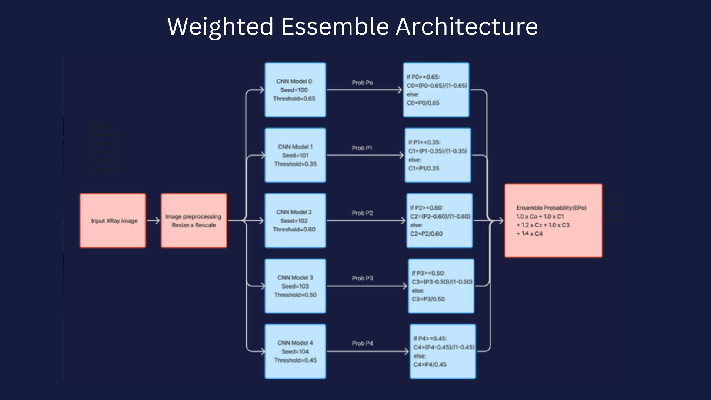
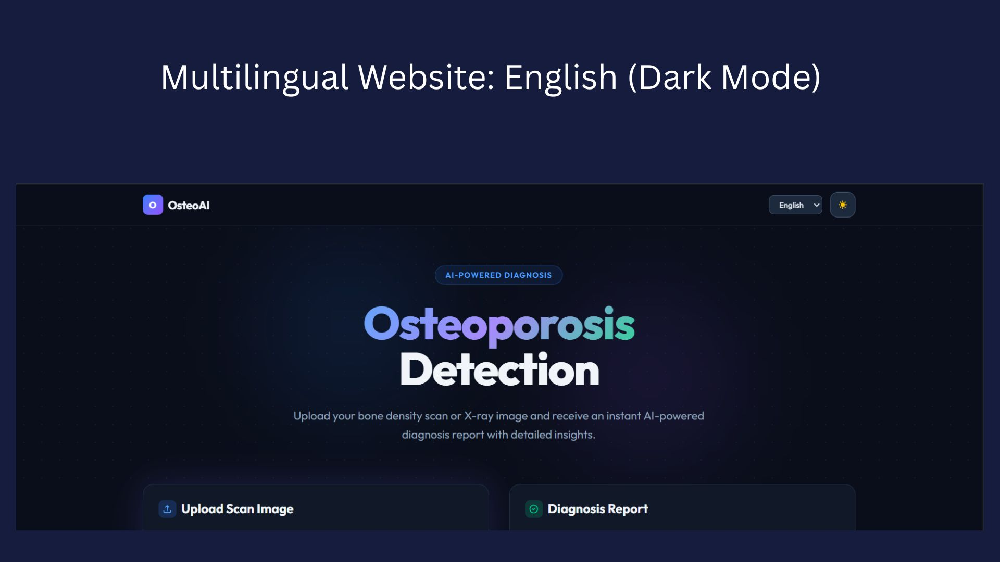
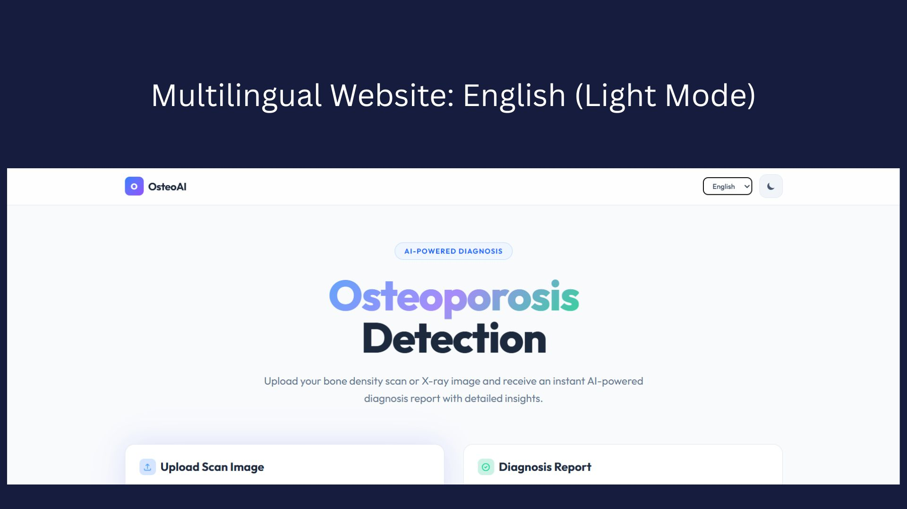
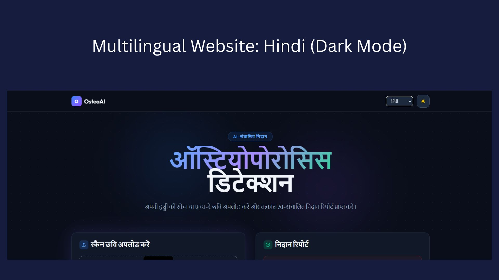
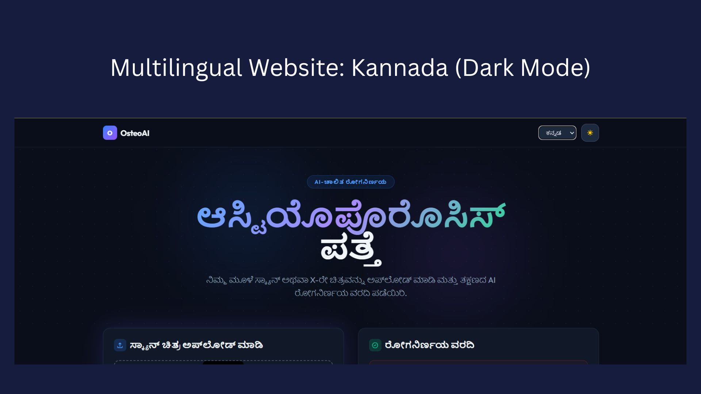
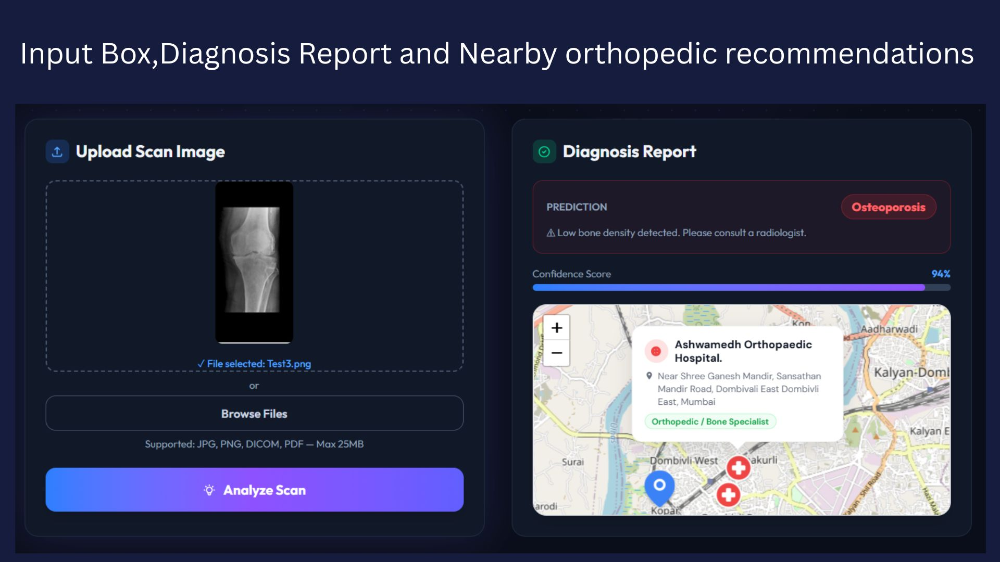
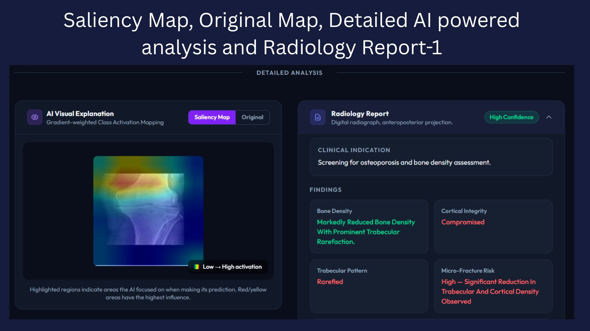
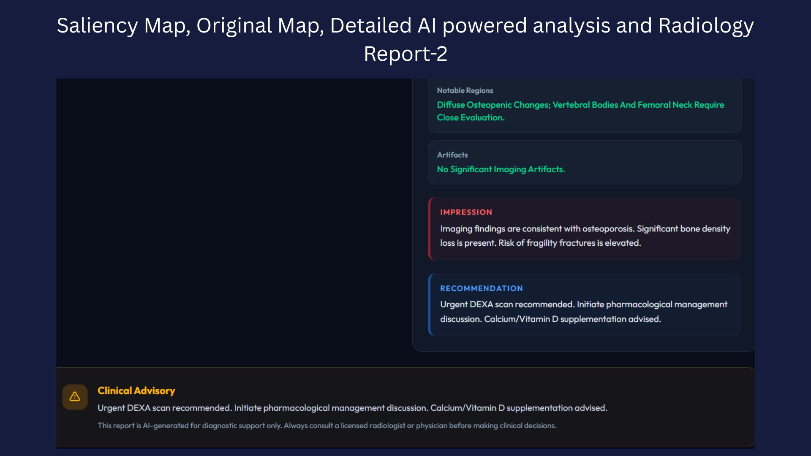
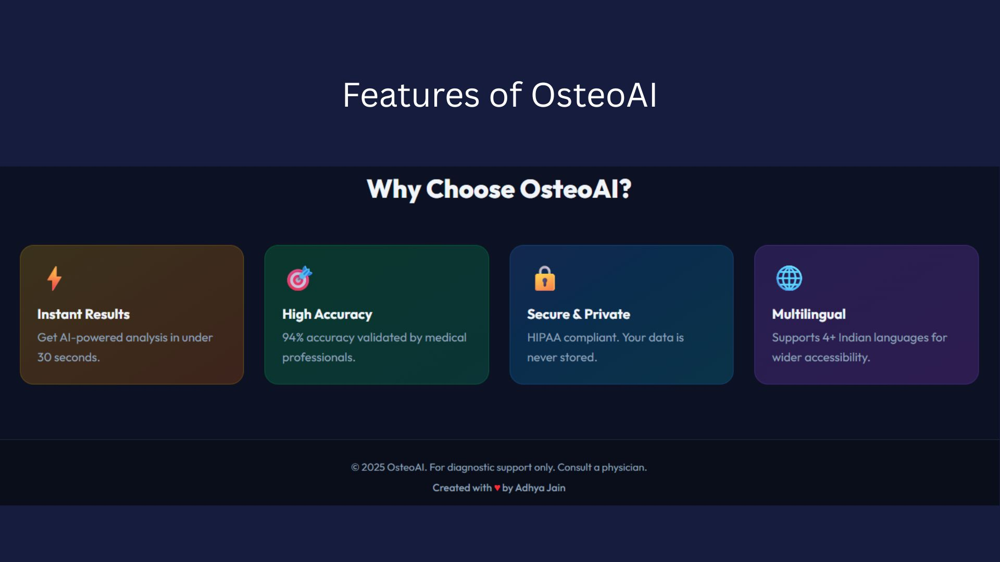

# 🦴 AI-Based Osteoporosis Detection System

[](https://www.python.org/)
[](https://www.tensorflow.org/)
[](https://fastapi.tiangolo.com/)
[](https://reactjs.org/)

An advanced, end-to-end medical image analysis platform designed to detect osteoporosis from X-ray images. Built as a cost-effective and highly accessible alternative to traditional DEXA scans, this system leverages a weighted ensemble of Convolutional Neural Networks (CNNs), Explainable AI (XAI), and Large Language Models (LLMs) to provide automated, clinician-friendly diagnostic reporting.

---

## ✨ Key Features

* **Robust Ensemble Learning:** Utilizes a weighted ensemble of 5 custom CNN models trained via bagging and soft voting, ensuring high reliability on unseen data.
* **Explainable AI (XAI):** Implements Grad-CAM++ and Score-CAM to generate high-resolution saliency maps, highlighting micro-fracture regions and areas of compromised bone density.
* **Automated Clinical Reporting:** Integrates OpenAI API / local Ollama LLMs to interpret saliency map data and automatically generate comprehensive, plain-text diagnostic reports.
* **Multilingual Web Interface:** Features a responsive React.js frontend supporting English, Hindi, Marathi, and Kannada (with Dark/Light mode toggles) for diverse regional accessibility.
* **Actionable Healthcare Insights:** Includes a geolocation-based module that recommends nearby orthopedic hospitals and bone specialists upon diagnosis.

---

## 🛠️ Technology Stack

### Machine Learning & AI
* **Frameworks:** TensorFlow/Keras, OpenCV, NumPy, Pillow
* **Architecture:** Custom CNNs, Weighted Ensemble
* **Explainability:** Grad-CAM++, Score-CAM
* **LLM Integration:** OpenAI API / Ollama

### Backend
* **Framework:** FastAPI
* **Server:** Uvicorn

### Frontend
* **Framework:** React.js
* **Styling:** Custom CSS / Tailwind (Dark & Light Mode Support)
* **Maps API:** Integrated for local hospital routing

---

## 🏗️ System Architecture

### 1. Custom CNN Architecture
The backbone of the feature extraction pipeline, optimized for detecting nuanced trabecular patterns in bone structures.



### 2. Weighted Ensemble Architecture
An ensemble of 5 distinct CNNs with dynamic probability thresholding to maximize predictive accuracy.



---

## 📊 Performance Metrics

Extensive image preprocessing (resizing, normalization, noise reduction, and data augmentation) was applied prior to training. 

* **Individual CNN Accuracy:** 90% – 93%
* **Ensemble Accuracy:** **94%**
* **Precision:** 0.94
* **Recall:** 0.94
* **F1-Score:** 0.94

---

## 💻 User Interface Highlights

### Multilingual Support & Accessibility
The UI is fully localized to ensure ease of use across different demographics.
<p align="center">
  
  
</p>
<p align="center">
  
  
</p>

### Diagnostic Workflow
Clinicians can securely upload X-ray scans and instantly receive probability scores, saliency maps, AI-generated radiology reports, and local clinic recommendations.
<p align="center">
  
</p>
<p align="center">
  
</p>
<p align="center">
  
</p>
<p align="center">
  
</p>

---

## 🚀 Installation & Setup

### Prerequisites
* Python 3.8+
* Node.js & npm (for Frontend)

### 1. Model Preparation
Before running the backend, you must generate the models. Open the Jupyter Notebook and execute all cells sequentially:
```bash
jupyter notebook custom_cnn_3.ipynb

## 🧠 Model Weights

After training, ensure that all **5 ensemble model weights** are saved in the appropriate directory used by the backend API.

Example:

```text
OSP/
├── custom_cnn_0.h5
├── custom_cnn_1.h5
├── custom_cnn_2.h5
├── custom_cnn_3.h5
└── custom_cnn_4.h5
```

> **Note:** The backend loads all five models during startup. Missing weight files will cause the API initialization to fail.

---

## ⚙️ Backend Environment Setup

### Windows

```bash
python -m venv ai_env
ai_env\Scripts\activate

cd OSP

pip install -r requirements.txt
```

### macOS / Linux

```bash
python3 -m venv ai_env
source ai_env/bin/activate

cd OSP

pip install -r requirements.txt
```

---

## 🚀 Run the Backend API

Start the FastAPI application using Uvicorn:

```bash
uvicorn Api:app --reload
```

Once the server starts, the API will be available at:

```text
http://localhost:8000
```

Interactive Swagger documentation:

```text
http://localhost:8000/docs
```

---

## 📦 Requirements (`OSP/requirements.txt`)

```txt
fastapi==0.111.0
uvicorn[standard]==0.30.1
python-multipart==0.0.9
tensorflow==2.16.1
numpy==1.26.4
opencv-python-headless==4.9.0.80
Pillow==10.3.0
gdown==5.2.0
requests==2.31.0
```

> **Note:** If no GPU is available, you may use:
>
> ```txt
> tensorflow-cpu==2.16.1
> ```

---

## ⚠️ Disclaimer

**OsteoVision AI** is an AI-powered osteoporosis screening and clinical decision support system intended for research, educational, and assistive diagnostic purposes only.

The predictions, Grad-CAM visualizations, and AI-generated radiology reports produced by this system should **not** be considered a substitute for professional medical advice, diagnosis, or treatment.

Always consult a qualified radiologist, physician, or healthcare professional before making any clinical decisions based on the output of this application.

